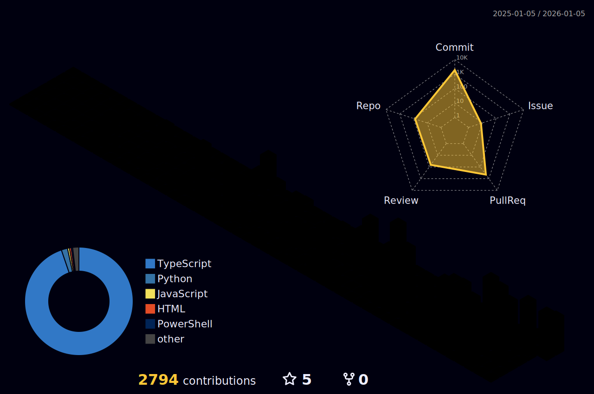

# AI Engineer • AI Agent Systems • AI-Native Development

I'm an AI Engineer focused on building intelligent systems where AI is an integral part of the software engineering process—not just another feature.

My work combines modern coding agents, autonomous workflows, system architecture, and developer tooling to accelerate software development while maintaining engineering quality.

## Areas of Interest

* AI Coding Agents
* Claude Code & AI-assisted Development
* AI Engineering Infrastructure
* Agentic Systems & Multi-Agent Workflows
* MCP Integrations
* Automation Platforms
* Backend Architecture
* Knowledge Graphs & Memory Systems
* Developer Experience (DX)

## Engineering Philosophy

I believe the future of software engineering is shifting from writing every line of code manually to designing reliable systems where humans and AI collaborate effectively.

My focus is on building reproducible workflows, robust architectures, and reusable engineering patterns that make AI-powered development faster, safer, and easier to scale.

## What You'll Find Here

* Open-source projects
* AI engineering experiments
* System architecture designs
* Technical research
* Developer tools
* Workflow templates
* Documentation and engineering notes

Every repository is treated as an engineering case study, documenting not only the final implementation but also the design decisions, trade-offs, experiments, and lessons learned along the way.

---

**Building the next generation of AI-native software.**

  

  
  
  

<!--
**ivan-meer/ivan-meer** is a ✨ _special_ ✨ repository because its `README.md` (this file) appears on your GitHub profile.

Here are some ideas to get you started:

- 🔭 I’m currently working on ...
- 🌱 I’m currently learning ...
- 👯 I’m looking to collaborate on ...
- 🤔 I’m looking for help with ...
- 💬 Ask me about ...
- 📫 How to reach me: ...
- 😄 Pronouns: ...
- ⚡ Fun fact: ...
-->

name=README.md

# 🚀 Ivan Meer

### AI Engineer • AI Agent Systems • AI-Native Software Engineering

> Building the infrastructure where humans and AI create software together.

---

## 👋 About Me

I'm an **AI Engineer** passionate about designing developer tools, autonomous agents, and infrastructure that makes software engineering itself more intelligent.

Rather than simply writing code, I build **systems that augment human creativity** with AI capabilities—creating workflows where humans and machines collaborate seamlessly.

<b>🎯 Core Focus Areas</b>

- 🤖 **AI Coding Agents** – Autonomous systems for intelligent development
- 🧠 **Agent Architecture** – Reliable, observable AI systems
- 🏗️ **AI Engineering** – Best practices for AI-native applications
- 🔌 **MCP Ecosystem** – Model Context Protocol integration
- ⚡ **AI Automation** – Intelligent workflow automation
- 📚 **Knowledge Systems** – Context and memory for AI
- 🧩 **Developer Tooling** – Next-gen IDE & workflow tools
- ☁️ **Cloud Infrastructure** – Scalable AI backends

---

## 🚀 Currently Building

| 🚀 Project | 📝 Description | 🔧 Status |
|-----------|---------------|----------|
| **AdminHero** | AI command center for business operations | `In Progress` |
| **Agent Harness** | Runtime layer for AI coding agents | `Active Development` |
| **VibeOS** | Operating system for AI-native engineering | `Research Phase` |
| **AI Engineering Lab** | Experimental AI projects & research | `Ongoing` |

---

## ⭐ Featured Projects

### 🚀 AdminHero
Control center for AI agents, automations and business operations.