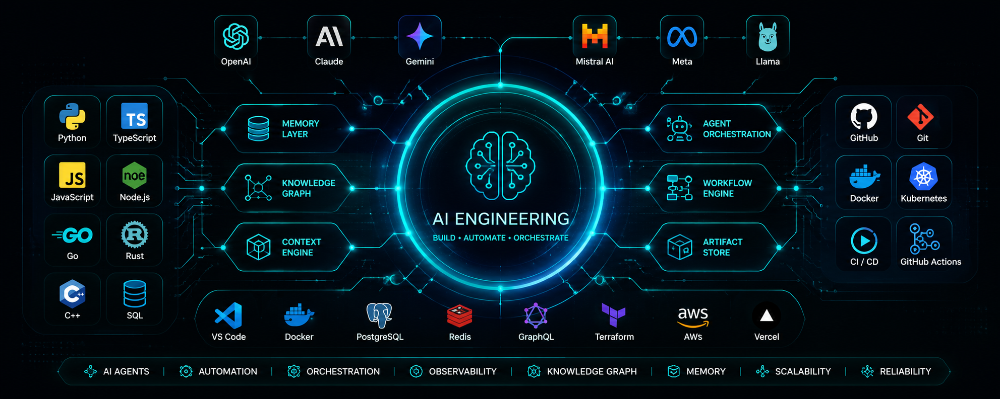
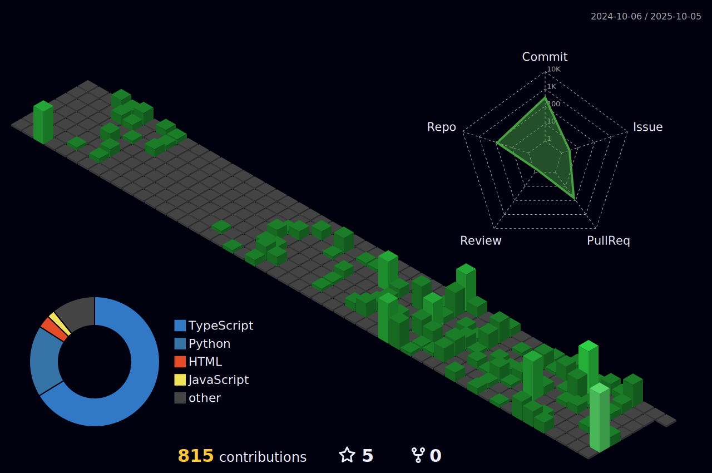

# 🚀 Ivan Meer

### AI Engineer • AI Agent Systems • AI-Native Software Engineering

> Building the infrastructure where humans and AI create software together.

---

## 👋 About Me

I'm an **AI Engineer** passionate about designing developer tools, autonomous agents, and infrastructure that makes software engineering itself more intelligent.

Rather than simply writing code, I build **systems that augment human creativity** with AI capabilities — creating workflows where humans and machines collaborate seamlessly.

<b>🎯 Core Focus Areas</b>

- 🤖 **AI Coding Agents** — Autonomous systems for intelligent development
- 🧠 **Agent Architecture** — Reliable, observable AI systems
- 🏗️ **AI Engineering** — Best practices for AI-native applications
- 🔌 **MCP Ecosystem** — Model Context Protocol integration
- ⚡ **AI Automation** — Intelligent workflow automation
- 📚 **Knowledge Systems** — Context and memory for AI
- 🧩 **Developer Tooling** — Next-gen IDE & workflow tools
- ☁️ **Cloud Infrastructure** — Scalable AI backends

---

## 🚀 Currently Building

| 🚀 Project | 📝 Description | 🔧 Status |
|-----------|---------------|----------|
| **AdminHero** | AI command center for business operations | `In Progress` |
| **Agent Harness** | Runtime layer for AI coding agents | `Active Development` |
| **VibeOS** | Operating system for AI-native engineering | `Research Phase` |
| **AI Engineering Lab** | Experimental AI projects & research | `Ongoing` |

---

## ⭐ Featured Projects

### 🚀 AdminHero
Control center for AI agents, automations and business operations.
*AI Agents · Business Automation · Command Center*

### 🎵 AI MusicVerse
AI-powered music creation platform with agentic workflows.
[`HOW2AI-AGENCY/aimusicverse`](https://github.com/HOW2AI-AGENCY/aimusicverse)
*AI Music · Audio Generation · Agentic Workflows*

### 📄 Mistral OCR App
Document OCR application powered by Mistral AI vision models.
[`ivan-meer/mistral-ocr-app`](https://github.com/ivan-meer/mistral-ocr-app)
*OCR · Mistral AI · Document Processing*

### 🤖 Claude Code Custom
Custom configurations, plugins and extensions for Claude Code CLI.
[`ivan-meer/claude-code-custom`](https://github.com/ivan-meer/claude-code-custom)
*Claude Code · Developer Tooling · AI-Assisted Development*

### 🧪 AI Engineering Lab
Collection of experimental AI projects, research notes, and awesome resources.
*AI Research · Experiments · Awesome Lists*

---

## 📊 GitHub Analytics

---

## 📫 Let's Connect

- 🌐 **Portfolio**: [ivan-meer.github.io](https://ivan-meer.github.io) — coming soon
- 💼 **LinkedIn**: [ivan-meer](https://linkedin.com/in/ivan-meer)
- ✈️ **Telegram**: [@ivan_meer](https://t.me/ivan_meer)
- 📄 **Resume**: [View my CV](https://ivan-meer.github.io/resume)

---

  

  

---

  <i>Generated with ❤️ by AI</i>

